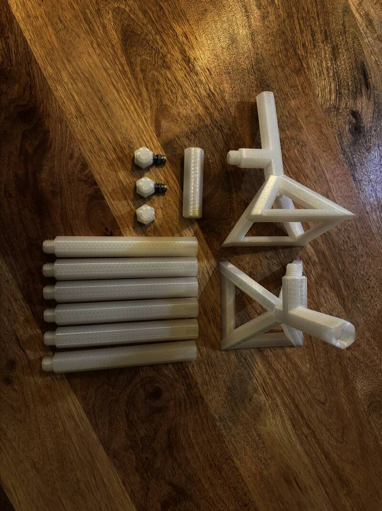
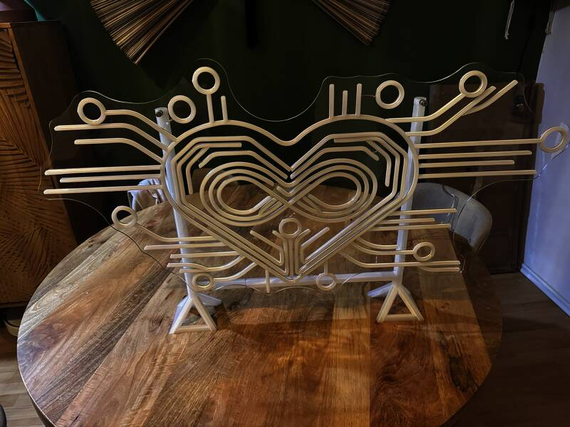

Hexagonal element stand (unrefined)

[Licensed under CC-BY-SA](https://creativecommons.org/licenses/by-sa/4.0/)

Simple stand consisting of:

- stand-leg.scad - simple legs which can be interconnected
- stand-connector.scad - vertical and horizontal connectors
- stand-coupling.scad - coupling to connect legs
- stand-head.scad - screwable head supporting insets

Unrefined version without templates or variables.

Printed on Prusa CORE ONE with 25% infill and bed support, threaded inserts added.

[Printable Link](https://www.printables.com/model/1506916-hexagonal-element-stand-unrefined)
